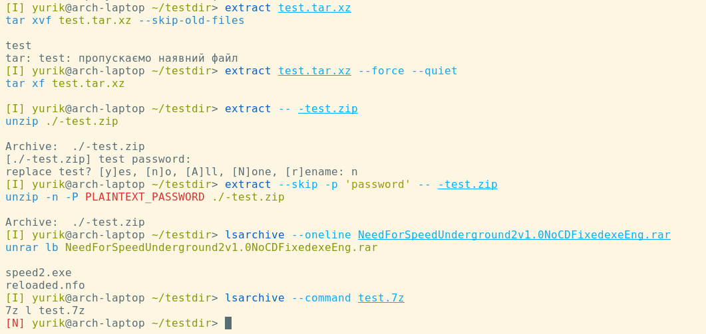

Helps you extract archives and list their contents.

## TODO: readme

It's supposed to be a helpful and also educational tool. Suggests the simplest command for the appropriate archive format, while also being non-destructive by default (does not overwrite existing files, does not delete the archive after extraction, etc).

Supported archive and compression formats:

| File extenstion | Tool |
| --------------- | :--- |
| `.tar`, `.tar.*`, `.tgz`, `.tbz`, `.txz`, `.tlz`, `.tzo` | `tar` |
| `.zip` | `unzip` |
| `.rar` | `unrar` |
| `.7z` | `7z` |
| `.bz2`, `.bz` | `bzip2` (`bunzip2`, `bzcat`) |
| `.gz` | `gzip` (`gunzip2`, `zcat`) |
| `.lrz` | `lrzip` (`lrunzip`, `lrzcat`) |
| `.lz` | `lzip` |
| `.lz4` | `lz4` (`unlz4`) |
| `.lzma` | `xz` (`unlzma`, `lzcat`) |
| `.lzo` | `lzop` |
| `.zst` | `zstd` (`unzstd`) |
| `.xz` | `xz` (`unxz`, `xzcat`) |
| `.Z` | `uncompress` |
| Everything else | `7z` |

